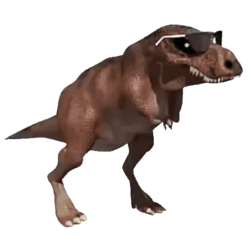
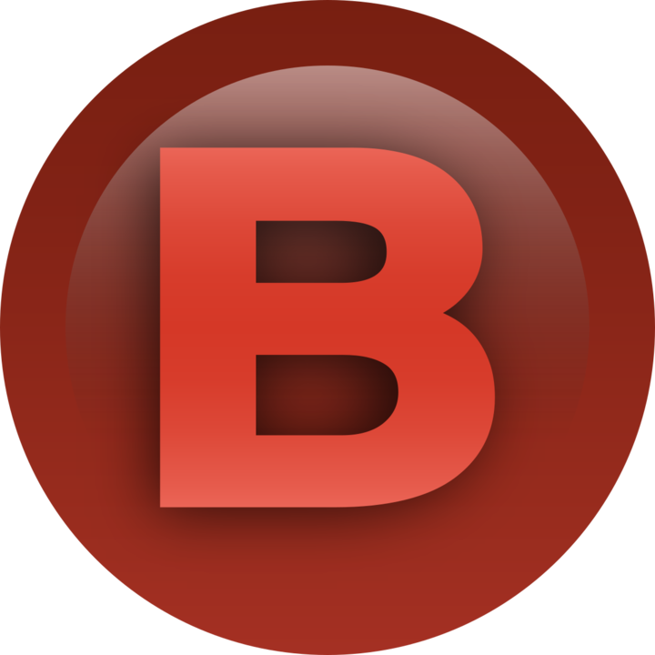

<h1 align="center">
  
  
Game Dino Dancer

  
</h1>

# 📘 Índice 

* [Índice](#-índice)
* [Funcionalidades do Projeto](#-funcionalidades-do-projeto)
* [Acesso ao Projeto](#-acesso-ao-projeto)
* [Abrir e Rodar o Projeto](#%EF%B8%8F-abrir-e-rodar-o-projeto)
* [Como Jogar](#-como-jogar)
* [Técnicas e Tecnologias Utilizadas](#%EF%B8%8F-t%C3%A9cnicas-e-tecnologias-utilizadas)
* [Conclusão](#%EF%B8%8F-conclusão)

# 🔨 Funcionalidades do Projeto

O projeto Dino Game é um jogo de plataforma em que você deve pular obstáculos. A cada mil pontos a velocidade aumenta. A distância dos obstáculos é calculada automaticamente.
Foi criado totalmente em HTLM, CSS e JS.
  
Principais recursos:

- Suporte a controle;
- Clima dinâminco;
- Música aleatória;
- Configuração de som (escolha o que deseja ouvir);
- Últimas pontuações;
- Placar de líderes;
- Armazenamento de dados no local Storage.

# 📁 Acesso ao Projeto

>Para acessar a página [clique aqui](https://wendell95araujo.github.io/dinogame.io/)

Neste repositório você tem acesso a todo o material.

# 🛠️ Abrir e rodar o projeto

Para abrir e rodar o projeto, basta abrir o aquivo index.html no navegador.

# ❓ Como Jogar

▶️ Iniciar:
- ⌨️ (Seta para cima) 
- 🎮 (Botão START) 
  

↗️ Pulo:
- ⌨️ (Seta para cima) 
- 🎮 (Botão A) 
  

🔁 Recomeçar:
- ⌨️ (Tecla S) 
- 🎮 (Botão A) 
  

❎ Sair:
- ⌨️ (Tecla N) 
- 🎮 (Botão B) 
  

🔊 Ligar/Desligar Efeito de Som:
- ⌨️ (Clicar no Checkbox) ✅
- 🎮 (Botão Y) 
  

🎵 Ligar/Desligar Música:
- ⌨️ (Clicar no Checkbox) ✅
- 🎮 (Botão X) 
  

# ✔️ Técnicas e Tecnologias Utilizadas

- ``HTML5``
- ``CSS3``
- ``js``

# ☝️ Conclusão
Divirta-se jogando esse simples jogo!
