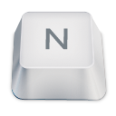

<h1>
  
  
Game Dino Dancer

</h1>

<h2>🔨 Funcionalidades do projeto</h2>

O projeto Dino Dancer é um jogo de plataforma em que você deve pular obstáculos. Foi criado totalmente em HTLM, CSS e JS. Recursos:

- Suporte a controle;
- Clima dinâminco;
- Música aleatória;
- Configuração de som (escolha o que deseja ouvir);
- Placar de líderes;
- Últimas pontuações;
- Armazenamento de dados no local Storage.

<h2>📁 Acesso ao projeto</h2>

>Para acessar a página [clique aqui](https://wendell95araujo.github.io/dinogame.io/)

Neste repositório você tem acesso a todo o material.

<h2>🛠️ Abrir e rodar o projeto</h2>

Para abrir e rodar o projeto, basta abrir o aquivo index.html no navegador.

<h2>❓ Como Jogar</h2>

▶️ Iniciar:
- ``TECLADO`` (Seta para cima) 
- ``CONTROLE`` (Botão START) 

↗️ Pulo:
- ``TECLADO`` (Seta para cima) 
- ``CONTROLE`` (Botão A) 

🔁 Recomeçar:
- ``TECLADO`` (Tecla S) 
- ``CONTROLE`` (Botão A) 

❎ Sair:
- ``TECLADO`` (Tecla N) 
- ``CONTROLE`` (Botão B) 

<h2>✔️ Técnicas e tecnologias utilizadas</h2>

- ``HTML5``
- ``CSS3``
- ``js``
